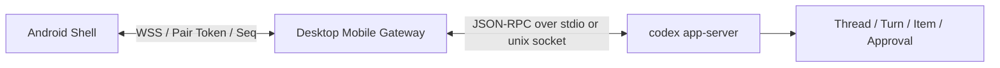

# Codex Android 壳设计文档

## 1. 目标
- 做一个只覆盖“会话域”的 Android 壳。
- Android 不处理登录、API key、MCP、Skill、插件市场。
- Desktop 是真源；Android 只做实时同步、展示、输入、审批、补充操作。
- 产品目标不是“聊天壳”，而是尽量还原 Codex Desktop 的完整会话工作流。

## 2. 最新官方接口确认
基于 `openai/codex` 官方 `codex-rs/app-server/README.md` 当前主干文档确认：

- `codex app-server` 使用 JSON-RPC 2.0；线上的消息体省略 `"jsonrpc":"2.0"`。
- 支持 `stdio`、`unix socket`、`ws://`、`off` 四种监听模式。
- `ws://` 被官方标注为 experimental / unsupported，不能作为生产链路依赖。
- 每条连接都必须先发 `initialize`，再发 `initialized`；否则其他请求会被拒绝。
- schema 可由当前版本直接生成：
  - `codex app-server generate-ts --out DIR`
  - `codex app-server generate-json-schema --out DIR`
- `experimentalApi` 需要在 `initialize` 时显式开启；未开启时，实验方法和实验字段会被拒绝。
- 会话核心原语已确认是 `thread`、`turn`、`item`。

结论：
- 推荐链路仍然是 `Android -> desktop gateway -> codex app-server`。
- 不直连 app-server websocket。
- 网关对 Android 暴露自定义安全通道，app-server 只作为桌面本地控制面。

## 3. 已核实的会话相关能力

### 3.1 稳定能力
- 线程：
  - `thread/start`
  - `thread/resume`
  - `thread/fork`
  - `thread/list`
  - `thread/loaded/list`
  - `thread/read`
  - `thread/metadata/update`
  - `thread/goal/set`
  - `thread/goal/get`
  - `thread/goal/clear`
  - `thread/archive`
  - `thread/unarchive`
  - `thread/name/set`
  - `thread/unsubscribe`
  - `thread/compact/start`
  - `thread/shellCommand`
  - `thread/rollback`
  - `thread/inject_items`
- 回合：
  - `turn/start`
  - `turn/steer`
  - `turn/interrupt`
- 文件：
  - `fs/readFile`
  - `fs/readDirectory`
  - `fs/getMetadata`
  - `fs/watch`
  - `fs/unwatch`
- 通知：
  - `thread/started`
  - `thread/status/changed`
  - `thread/name/updated`
  - `thread/archived`
  - `thread/unarchived`
  - `thread/goal/updated`
  - `thread/goal/cleared`
  - `turn/started`
  - `turn/completed`
  - `item/started`
  - `item/completed`
  - `item/agentMessage/delta`
  - `serverRequest/resolved`
- 审批 / 追问：
  - `item/commandExecution/requestApproval`
  - `item/fileChange/requestApproval`
  - `item/permissions/requestApproval`
  - `mcpServer/elicitation/request`

### 3.2 实验能力
- `thread/turns/list`
- `thread/turns/items/list`：协议形状存在，但 README 明确写了当前仍返回 unsupported-method
- `thread/realtime/start`
- `thread/realtime/appendAudio`
- `thread/realtime/appendText`
- `thread/realtime/stop`
- `thread/backgroundTerminals/clean`
- `thread/memoryMode/set`
- `review/start`
- `item/tool/requestUserInput`

### 3.3 当前不纳入 Android 壳
- `account/*`
- `mcpServer/oauth/login`
- `skills/*`
- `plugin/*`
- `marketplace/*`
- `config/*`
- `app/list`

原因：
- 这些能力不属于“已有会话”的 Android 壳主范围。
- 就算 app-server 支持，也不该把这些桌面管理面搬到手机上。

## 4. 推荐架构



### 4.1 app-server 职责
- 线程、回合、item、流式增量
- 审批请求
- 历史持久化
- 线程恢复、归档、分叉、压缩、回滚

### 4.2 gateway 职责
- 桌面本地启动和守护 app-server
- `initialize` 握手和版本探测
- Android 侧鉴权、配对、续期
- snapshot + event fanout
- 断线补拉、`seq` 去重、重放
- 聚合 app-server `fs/*` 能力，做文件读取、目录浏览、最近文件索引
- 附件上传、图片转发、文本片段注入
- diff 聚合、命令输出聚合
- 将多种 app-server 事件整理成移动端更稳定的 ViewModel

### 4.3 Android 职责
- 会话列表 / 详情渲染
- 输入区与输入状态机
- 审批响应
- 补充输入
- 离线提示、重试、通知

## 5. 网关必须补齐的能力
这些能力是“仿 Desktop 完整体验”必须补上的，但 app-server 不直接给完整移动端体验：

- 文件搜索
- 最近文件
- 最近命令
- 附件元信息卡片
- diff 预览聚合
- 复制路径 / 插入路径
- 会话草稿缓存
- 断线重连后的局部重放

补充说明：
- 文件读取、目录浏览、元数据读取，优先复用 app-server 稳定 `fs/readFile`、`fs/readDirectory`、`fs/getMetadata`。
- gateway 主要补“搜索、索引、缓存、移动端友好聚合”，不是重复造文件 RPC。

## 6. 信息架构

### 6.1 v1 页面
1. 会话列表 / 抽屉
2. 会话详情
3. 输入区展开态
4. 审批底部面板
5. 附件 / 上下文底部面板

### 6.2 v1 不做
- 登录页
- 设置中心
- Profile 页
- 技能管理页
- MCP 管理页
- 欢迎语推荐卡片页

## 7. 对 Stitch 稿的审查结论

### 7.1 `_1` 首页问题
- 方向错了。当前是“新建聊天欢迎页”，不是“已有会话壳”。
- `How can I help you today?` 和四宫格建议卡是 ChatGPT 通用空态，不适合 Codex 会话壳。
- 这个页面没有体现“最近会话、同步状态、继续上次工作”。
- 底部输入条太弱，只有输入和发送，没有会话工作流入口。
- 常驻免责声明占空间，移动端应去掉。

### 7.2 `_2` 会话页问题
- 整体太像普通聊天产品，Codex 的“工作流感”不够。
- AI 内容用了过重的灰色气泡；应更接近 ChatGPT 手机端的白底正文流。
- 代码块过重、过暗、占比过大，压住正文。
- `Generating...` 和输入区是割裂的，没有体现“生成中继续补充输入”的能力。
- 缺附件、上下文、最近命令、`/` 命令、`!` 命令、停止/继续/重试等入口。

### 7.3 `_3` 抽屉页问题
- `Settings`、`Profile` 超出产品边界，必须删除。
- 抽屉内容缺搜索、状态标签、归档过滤、会话级操作。
- 当前更像通用聊天历史，不像开发者工具会话历史。

## 8. UI 修订方向

### 8.1 总体视觉
- 直接对齐 ChatGPT 手机端浅色风格。
- 白 / 近白底色，黑灰文字，极轻分割线。
- 少卡片、少重边框、少大圆角堆砌。
- 不要欢迎大标题，不要推荐四宫格，不要营销式留白。
- 重点从“首页装饰”转到“会话内容”和“输入工作台”。

### 8.2 顶栏
- 左：会话抽屉入口
- 中：当前线程名，过长省略
- 右：新动作按钮组

v1 推荐保留：
- 搜索 / 切换会话
- 更多菜单

v1 不推荐保留：
- 通用“新聊天欢迎页”入口

### 8.3 会话列表
必须包含：
- 搜索
- 最近会话
- 运行中 / 空闲 / 失败 / 未加载状态
- 归档过滤
- 长按或更多菜单：重命名、分叉、归档

### 8.4 会话详情
消息区不应是重气泡聊天感，而应接近 ChatGPT 手机端：
- 白底正文流
- 用户消息可保留深色气泡
- 助手消息尽量平铺，少包裹
- 代码块、命令输出、文件 diff 用独立内容块
- 审批卡片与普通消息明显区分

## 9. 输入区规范
输入区是本项目最高优先级区域。

### 9.1 折叠态
必须有：
- `+` 入口
- 多行输入框
- 发送按钮
- 生成中时的停止按钮

### 9.2 展开态
必须有：
- 已附加文件 chip
- 已附加上下文 chip
- 当前 cwd / 权限摘要
- `/` 命令建议
- `!` 命令入口
- 运行中补充输入入口

### 9.3 状态机
- 空输入
- 输入中
- 已附加内容
- 发送中
- 生成中
- 生成中补充输入
- 待审批
- 待用户补充
- 失败可重试
- 断连只保留草稿

### 9.4 交互要求
- 输入区始终固定底部
- 生成中仍允许继续 steer
- 所有高频动作优先从输入区完成
- 底部面板替代桌面 hover 菜单

## 10. UI 动作到接口映射

### 10.1 会话
- 打开会话列表：`thread/list`
- 显示内存中活跃线程：`thread/loaded/list`
- 读取线程详情：`thread/read`
- 恢复线程：`thread/resume`
- 分叉线程：`thread/fork`
- 重命名：`thread/name/set`
- 归档 / 取消归档：`thread/archive` / `thread/unarchive`

### 10.2 输入
- 首次发送：`turn/start`
- 生成中补充输入：`turn/steer`
- 停止生成：`turn/interrupt`
- 注入结构化上下文：`thread/inject_items`
- 执行 `!` 命令：Android 先发 `send_prompt`，gateway 识别后先触发移动端审批；批准后才调用 `thread/shellCommand`
- 手动压缩：`thread/compact/start`

### 10.3 历史
- 默认读取线程：`thread/read`
- 长历史分页：`thread/turns/list`（实验能力，单独灰度）
- 回滚最近若干轮：`thread/rollback`

### 10.4 审批
- 命令审批：服务端发 `item/commandExecution/requestApproval`，客户端回 `{ decision: ... }`
- 文件改动审批：服务端发 `item/fileChange/requestApproval`，客户端回 `{ decision: ... }`
- 权限审批：服务端发 `item/permissions/requestApproval`，客户端回 `{ decision: ... }`
- 工具追问：服务端发 `item/tool/requestUserInput`，客户端回结构化答案
- MCP 追问：服务端发 `mcpServer/elicitation/request`，客户端按请求模式回填

### 10.5 Android <-> Gateway v0 草案
Android 不直接暴露 app-server 协议给 UI，而是先走一层更窄的移动端协议。

当前开发默认地址：
- 局域网 / 真机优先：`ws://192.168.31.97:8765/mobile`
- Android Emulator 直连宿主机兜底：`ws://10.0.2.2:8765/mobile`

Android -> gateway：
- `hello`
- `select_thread`
- `send_prompt`
- `stop_turn`
- `approve_pending`
- `reject_pending`

gateway -> Android：
- `status`
- `snapshot`
- `snapshot_patch`（Android `hello.capabilities` 声明后启用；未声明则继续整包 `snapshot`）

说明：
- `snapshot` 先覆盖线程列表、当前线程、消息流、审批、cwd、权限摘要、输入附件 chip。
- 首包仍用整包 `snapshot` 建基线；后续在支持端优先发送 `snapshot_patch`，按 revision 校验基线。
- 未协商 `snapshot_patch` 的客户端保持旧 `snapshot/status` 协议。
- `send_prompt` 当前不仅发普通 prompt，也承载输入区命令：
  - `/compact` -> gateway 调 `thread/compact/start`
  - `! xxx` -> gateway 先生成审批，再在批准后调 `thread/shellCommand`
  - `/goal` 目前仍未接真实 RPC，暂只保留为候选命令占位

## 11. Android v1 页面规范

### 11.1 首屏
- 默认进入“最近会话列表”或“上次活跃会话”
- 不出现欢迎语大标题
- 不出现推荐卡片

### 11.2 会话详情
- 顶部只有线程名和轻量操作
- 正文区优先展示最近 turn
- 代码块和输出块可以横向滚动
- 底部输入区固定

### 11.3 抽屉
- 搜索框
- 最近 / 归档 分组
- 会话状态点
- 会话更多菜单

删除：
- Settings
- Profile

## 12. 安全
- 首次配对用桌面端一次性配对码
- 换取短期 token
- 设备绑定
- WSS 传输
- 可选证书固定
- Android 不存 OpenAI key

## 13. 风险
- 若直接套通用聊天 UI，输入区价值会被做没。
- 若把“已有会话壳”误做成“新聊天首页”，产品会跑题。
- 若不做 gateway 层文件与附件增强，体验会明显弱于 Desktop。
- 若实验接口直接写死，不按 schema 生成，后续升级风险很高。

## 14. 下一步
1. 用当前 Codex 版本生成 stable / experimental schema。
2. 先冻结会话域网关协议。
3. 依据本文件重出一轮 Stitch 原型。
4. 原型先只做：
   - 会话列表
   - 会话详情
   - 输入区折叠态 / 展开态
   - 审批底部面板
5. 通过后再进入 Android Scaffold。

## 15. 当前实现状态
- Android Compose 壳已可运行。
- Android <-> desktop gateway 最小 WebSocket 链路已验证通过。
- desktop gateway 已成功桥接真实 `codex app-server`。
- Android 模拟器已验证连接当前 gateway：
  - `websocket opened: ws://10.0.2.2:8765/mobile`
  - 收到 `status=connected`
  - 收到真实 `snapshot`
- 已跑通：
  - `hello`
  - `status`
  - `snapshot`
  - `select_thread`
  - `send_prompt`
  - `stop_turn`
- 已跑通真实输入区链路：
  - `/` 命令面板展开
  - slash 搜索过滤
  - 点击 `/compact` 插入输入框
  - 文件面板展示 file chip 并插入输入框
- 已跑通真实命令分发：
  - `/compact` 已接到真实 `thread/compact/start`
  - `! dir` 已改成 gateway 预审批，批准后才执行真实 `thread/shellCommand`
- `approve_pending / reject_pending` 协议已接到 Android 和 gateway。
- `send_prompt` 在生成中已切到真实 `turn/steer`。
- `snapshot` 当前已来自真实 `thread/list + thread/read`，发送前会先 `thread/resume`。
- `send_prompt` 当前已调用真实 `turn/start`。
- `stop_turn` 当前已调用真实 `turn/interrupt`。
- gateway 不再按固定标题排除线程；自测需选择非当前项目会话，避免污染当前工作会话。
- gateway 已加入后端操作错误兜底：失败时向 Android 回 `status=error`，不直接崩进程。
- gateway 已加入约 120ms 的快照节流，避免高频通知直接刷爆 Android。
- `turn/started` 现在会先下发 `思考中` 占位，生成期不再表现为空白。
- `stop_turn` 时序已调整为等待后端完成通知后统一收口，不再本地提前判定结束。
- 已验证真实审批闭环：
  - `! dir` -> Android 收到待审批卡片
  - Android 真点击“允许” -> gateway 收到 `approve_pending`，随后执行真实 `thread/shellCommand`
  - `reject_pending` 协议闭环已通过探针验证，不执行 shell 命令
- 已补齐协议收敛：
  - 历史 `已请求压缩上下文 / 上下文已压缩` 状态会在回填时去重清洗
  - `item/commandExecution/outputDelta` 已改为增量累积，不再只保留最后一段输出
  - `thread/goal/updated / thread/goal/cleared` 已映射为移动端系统状态
  - 已增加 `npm run protocol:selftest`，通过内存 app-server stub 覆盖审批、compact、goal 通知、命令输出增量与归档清理，不污染真实 Codex 会话
  - Android 审批卡片“拒绝”按钮已有稳定 Compose instrumentation 测试覆盖，不再依赖 adb 文本注入
  - gateway 已支持 `snapshot_patch` 能力协商：支持端首包整包建基线，后续仅下发变更字段；旧客户端仍只收整包 `snapshot`
  - Android 已支持 `snapshot_patch` 解码、revision 基线校验与局部状态归并
- 已用本机 `codex 0.130.0` 重新生成 app-server schema 核对：仍无设置 goal 的 client request，当前只能消费 goal 通知，不能接真实 `/goal` 设置 RPC。
- 已知缺口：
  - `/goal` 仍未接真实设置 RPC；当前 app-server schema 未暴露对应 client request，需跟随 app-server 版本再核对。
- 下一开发阶段应切到：
  - `/goal` RPC 版本跟踪与真实设置链路

## 17. 本地开发标准流程

### 17.1 一键启动
本项目本地联调标准入口是：

```powershell
.\scripts\dev-run.ps1
```

该脚本必须完成：
- 杀掉旧的 gateway / node / tsx 进程
- 自动拉起 `codexflow_api35` 模拟器并等待开机完成
- 启动 `desktop-gateway` dev 模式并等待端口监听
- 安装 `debug` APK 到当前模拟器/设备
- 打开 `com.codex.mobile/.MainActivity`
- 将日志写入 `artifacts/`

### 17.2 例外情况
只有在排障时，才允许手工拆开执行：
- `cd desktop-gateway && npm run dev`
- `.\gradlew.bat :app:installDebug`
- `adb shell am start -n com.codex.mobile/.MainActivity`

### 17.3 约定
- 后续所有调试记录默认以 `scripts/dev-run.ps1` 为准。
- 如果脚本失效，先修脚本，不要每次临时探索部署流程。
- 真实验证时优先 debug 包，不用 release 包做日常联调。

## 16. 依据
- [openai/codex app-server README](https://github.com/openai/codex/blob/main/codex-rs/app-server/README.md)
- [OpenAI: Unlocking the Codex harness](https://openai.com/index/unlocking-the-codex-harness/)
